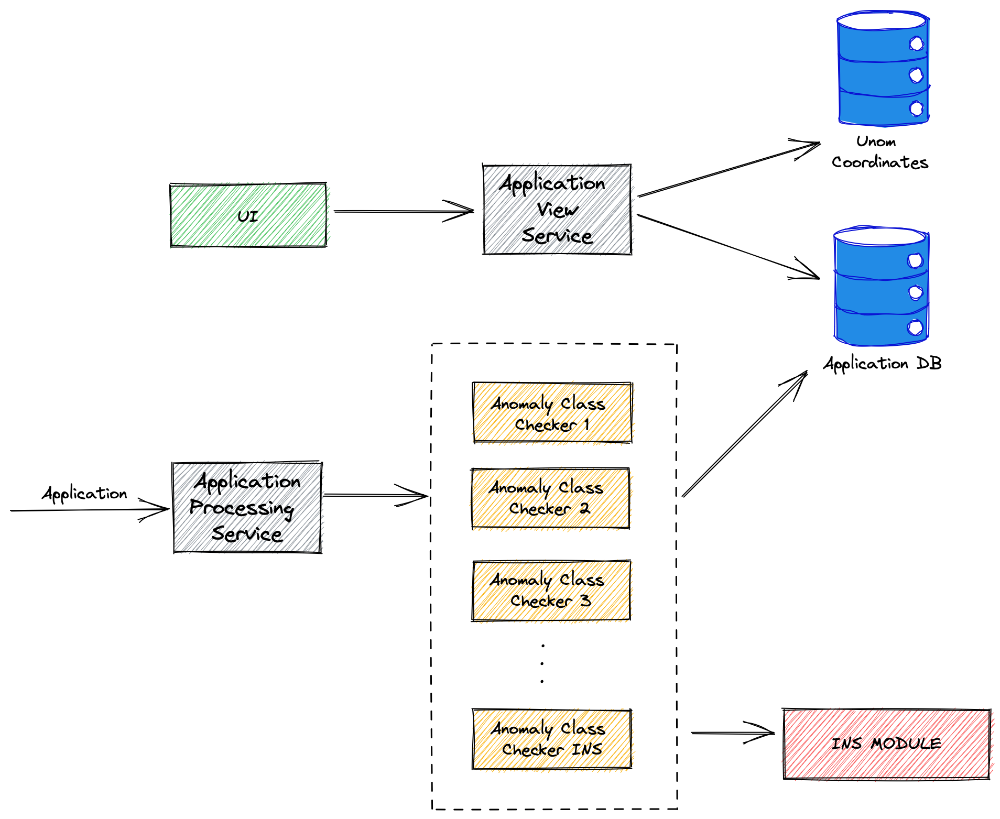
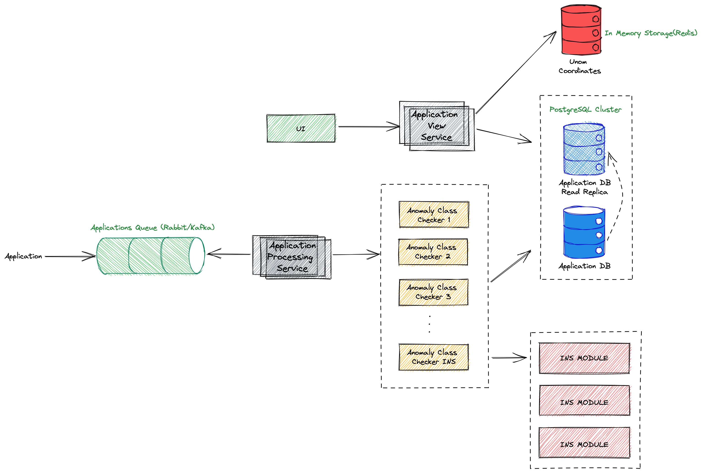

[[_TOC_]]

## Логическая схема компонентов

### Описание компонентов схемы

##### _Application Processing Service_ 
Обрабатывает поступившие в систему заявки. Заявка проходит через классификаторы аномальности. После прохождения всех классфикиторов заявке присваивается
статус аномальности(заявка аномальна если хотя бы один классификатор дал положительный ответ). После присвоения 
заявке статуса она помещается в базу данных.

##### _Anomaly Class Checker N_  
Программный компонент системы, содержащий в себе функции проверки заявки на предмет
аномальности. Сложность выполняемых функций разнится(от простых проверок по полям заявки до обращения в базу
данных заявок и к нейронному модулю). После проверки заявки - выдает ей статус аномальности по своему классу.

##### _INS MODULE_ 
Представляет собой полносвязную архитектуру, на вход которой подаются данные в 
нормализованном виде следующих полей:
- тип дефекта
- категория срочности
- вид выполненных работа
- охранные мероприятия

ИНС производит классификацию входящих параметров и выдает один единственный параметр - результативность.
На основе выхода ИНС производится сравнение предсказанного значения результативности с имеющимся в закрытой заявке.
Если выход ИНС не соответствует результативности в заявке - нейронная сеть сигнализирует в систему о наличии аномальности в закрытой заявке

##### _Application View Service_ 
Модуль, обрабатывающий запросы на отображение заявок. Запросы на отображение
заявок могут включать в себя различные фильтры(подробнее в документации API). Также, модуль предоставляет
возможность получать статистические данные с группировкой по различным полям(регионы, районы, классы аномальности 
и другое).

##### _Application DB_ 
База данных реляционного формата. Служит для хранения заявок.

##### _Unom Coordinates_ 
Хранилище координат объектов UNOM. Координаты UNOM объектов получены с помощью коллекции данных
сайта data.mos.ru. 

##### _UI_ 
Пользовательский интерфейс(frontend приложение), предоставлящее доступ пользователю к отображению заявок 
в формате карты, таблицы, статистических графиков.

## Алгоритм работы системы

Система предоставляет два способа взаимодействия. 
1. **Загрузка заявки.**

Система принимает заявку на обработку. Пропускает заявку через классификаторы аномальности и сохраняет 
заявку со статусом аномальности(аномальна или нет) в базу данных заявок. 
2. **Отображение заявок.**

Система предоставляет пользовательский интерфейс для взаимодействия авторизованного пользователя с
вкладками "Карта", "Таблица", "Статистика". Используя данные вкладки пользователь может получить информацию
об аномальных заявках в интересующем его виде.

## Используемые технологии

Используемые языки программирования:
* Frontend - **VueJS**
* Backend - **Golang**
* Neural Network - **PyTorch**

В качестве базы данных используется **Postgresql**.

Все сервисы написаны Stateless что позволяет гибко масштабировать 
систему под требуемые нагрузки. Однако, скорость обработки заявок вас
удивит и масштабирование понадобится не сразу.

## Скорость работы сервера

Проверка на аномальность 100000 заявок производится сервисом за 320 секунд(312.5 заявок в секунду)!

Данная скорость работы сервиса позволяет обрабатывать **9 839 232 000** заявок в год!

Для тестирования использовалась виртуальная машина с характеристиками
4vCPU, 16GB RAM.

## Предлагаемые шаги к масштабированию системы

1. Репликация сервисов View, Processing.
2. Использования сервиса очередей(Rabbit/Kafka) для приема заявок.
3. Обработка заявок из очереди сервисом Application Processing.
4. Использования горячего In Memory хранилища для сохранения координат UNOM объеков. 
Также, можно строить квадродерево из GPS координат UNOM объектов для запросов поиска заявок в каком то радиусе.
5. Создание реплики инстанса Postgres для чтения сервисом Application View. Это снимет с основного инстанса БД, 
задействованного в обработке заявок, нагрузку. 
6. Использование реплик INS MODULE.

## HTTP API Postman Collection

Предлагаем ознакомиться с коллекцией запросов Postman для сервиса: [Postman Collection](api/DUDELKINS.postman_collection.json) 